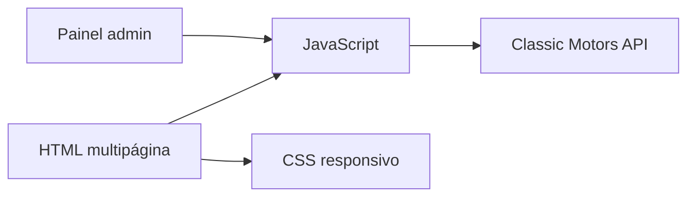

<p align="center">
  
</p>

<p align="center">
  <a href="https://github.com/Gustavo-tec0110/Classicmotors-FRONT/actions/workflows/ci.yml"></a>
  <a href="https://classicmotors-front.onrender.com"></a>
  
  
  
</p>

# Classic Motors

Interface responsiva para consulta e administração de anúncios automotivos. O projeto consome a [Classic Motors API](https://github.com/Gustavo-tec0110/Classicmotors--BACK), apresenta catálogo e detalhes de veículos e inclui fluxos de autenticação e painel administrativo.

## Screenshots


## Demonstração

- **Aplicação:** [classicmotors-front.onrender.com](https://classicmotors-front.onrender.com)
- **API:** [webmotors-clone-back.onrender.com](https://webmotors-clone-back.onrender.com)

O serviço utiliza a modalidade gratuita do Render e pode levar alguns segundos para responder após um período de inatividade.

## Funcionalidades

- catálogo de veículos;
- página de detalhes com galeria;
- navegação responsiva e tema escuro;
- cadastro e login;
- sessão persistida no navegador;
- área administrativa para manutenção de anúncios;
- integração REST com o backend Classic Motors.

## Arquitetura



## Tecnologias

HTML5, CSS3 e JavaScript sem framework. A validação automatizada usa Python apenas como ferramenta de CI para verificar a sintaxe básica e referências locais dos documentos.

## Como executar localmente

Por usar módulos e requisições HTTP, sirva a pasta com um servidor local:

```bash
git clone https://github.com/Gustavo-tec0110/Classicmotors-FRONT.git
cd Classicmotors-FRONT
python -m http.server 5500
```

Acesse `http://localhost:5500`. O backend deve estar disponível e aceitar essa origem em `CORS_ORIGINS`.

## Estrutura do projeto

```text
admin/                  # telas administrativas
assets/                 # imagens do projeto
css/                    # estilos por página
java/                   # integração, autenticação e comportamento
index.html              # catálogo
detalhes.html           # detalhes do veículo
login.html              # autenticação
scripts/validate_html.py
```

## Validação

```bash
python scripts/validate_html.py
```

O comando percorre todos os HTMLs e falha quando uma referência local aponta para um arquivo inexistente.

## Aprendizados

- construção de uma interface multipágina responsiva sem framework;
- consumo de API REST e manutenção de sessão no navegador;
- separação entre estrutura HTML, estilos e módulos JavaScript.

## Segurança

O frontend armazena o token JWT no `localStorage`, uma escolha aceitável para este protótipo, mas que aumenta o impacto de uma eventual falha de XSS. Para produção, a recomendação é migrar a sessão para cookie `HttpOnly`, definir CSP e revisar todo conteúdo dinâmico antes de inseri-lo no DOM.

## Próximos passos

- [ ] centralizar a URL da API em configuração de ambiente;
- [ ] substituir armazenamento de token por cookie seguro;
- [ ] adicionar testes E2E dos fluxos críticos;
- [ ] melhorar acessibilidade de formulários e modais;
- [ ] adotar um pipeline de otimização de imagens.

## Como contribuir

Pull Requests devem passar por `python scripts/validate_html.py` e explicar qualquer alteração no contrato consumido do backend.

## Licença

Distribuído sob a licença MIT. Consulte [LICENSE](LICENSE).

## Autor

Desenvolvido por **Gustavo Lopes** — [GitHub](https://github.com/Gustavo-tec0110).
